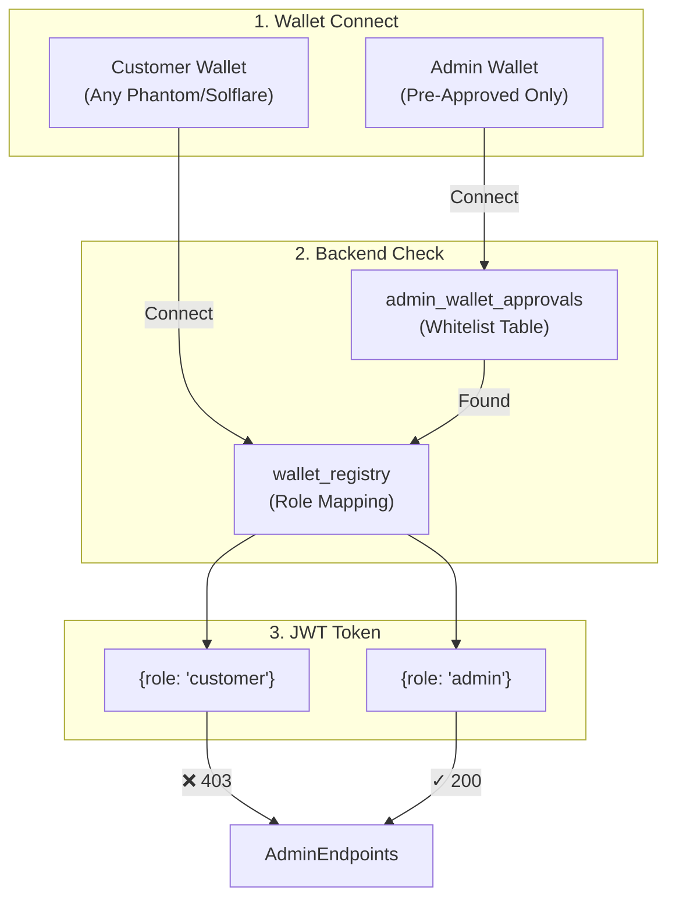
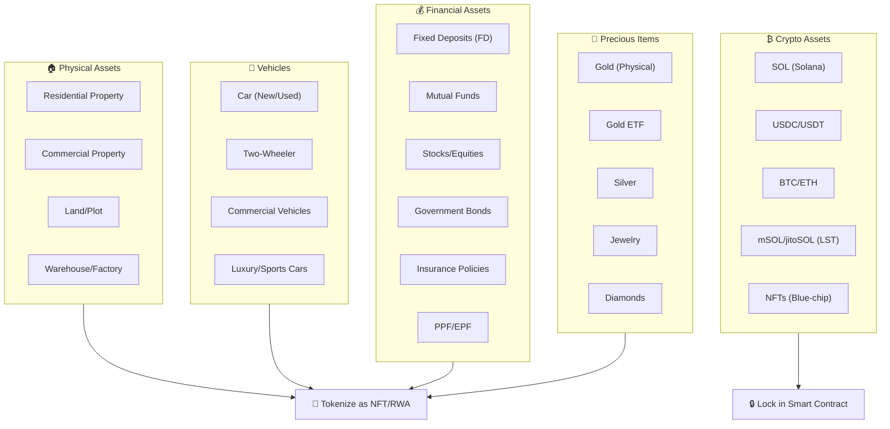
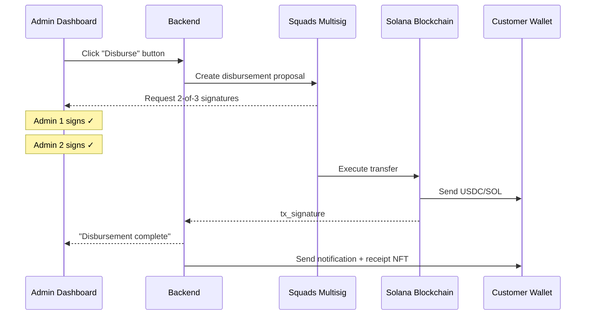

# 🚀 Solana Blockchain Integration - Complete Implementation Plan

Comprehensive plan covering **100+ features** plus detailed breakdowns of:
1. **Loan Form** with Property Asset tokenization
2. **6-Page Signup** with blockchain wallet linking
3. **Admin Disbursement** with multisig and Solana Pay

---

## 📋 Table of Contents

1. [Wallet Differentiation Architecture](#-wallet-differentiation-architecture)
2. [Loan Form with Property as Asset](#-loan-form-with-property-as-collateral)
3. [6-Page Signup with Blockchain](#-6-page-signup-with-blockchain)
4. [Admin Disbursement with Solana](#-admin-disbursement-with-solana)
5. [Solana Blinks Integration](#-solana-blinks-integration)
6. [x402 Payment Protocol](#-x402-http-payment-protocol)
7. [Zero-Knowledge Proofs (ZKP)](#-zero-knowledge-proofs-zkp)
8. [Document Storage & Signing](#-document-storage--signing)
9. [QR Codes with Blockchain](#-qr-codes-with-blockchain-verification)
10. [Customer Features](#-customer-wallet-features)
11. [Admin Features](#-admin-wallet--treasury)
12. [DAO Governance](#-dao-governance)

---

## 🔐 Wallet Differentiation Architecture

### Why Customers CANNOT Access Admin



### Database Schema

```sql
CREATE TABLE wallet_registry (
    id UUID PRIMARY KEY,
    wallet_address VARCHAR(44) UNIQUE NOT NULL,
    user_id UUID REFERENCES users(id),
    admin_id UUID REFERENCES admin_users(id),
    role VARCHAR(20) DEFAULT 'customer',
    linked_at TIMESTAMP DEFAULT NOW()
);

CREATE TABLE admin_wallet_approvals (
    id UUID PRIMARY KEY,
    wallet_address VARCHAR(44) UNIQUE NOT NULL,
    approved_by UUID REFERENCES admin_users(id),
    approved_at TIMESTAMP DEFAULT NOW()
);
```

---

## 🏠 Comprehensive Collateral System (15+ Asset Types)

Your loan form can now support **15+ collateral types**, all tokenized on Solana:

### Collateral Categories Overview



---

### 📋 All Collateral Types

| # | Category | Collateral Type | LTV Ratio | Blockchain Action | Interest Reduction |
|---|----------|-----------------|-----------|-------------------|-------------------|
| 1 | Property | Residential House/Flat | 70% | RWA NFT + IPFS docs | -1.5% |
| 2 | Property | Commercial Property | 60% | RWA NFT + valuation | -1.0% |
| 3 | Property | Land/Plot | 50% | RWA NFT + survey docs | -0.75% |
| 4 | Property | Warehouse/Factory | 55% | RWA NFT + lease records | -1.0% |
| 5 | Vehicle | Car (New) | 80% | Vehicle NFT + RC | -0.5% |
| 6 | Vehicle | Car (Used) | 60% | Vehicle NFT + valuation | -0.25% |
| 7 | Vehicle | Two-Wheeler | 70% | Vehicle NFT + RC | -0.25% |
| 8 | Vehicle | Commercial Vehicle | 65% | Fleet NFT + permits | -0.5% |
| 9 | Financial | Fixed Deposit (FD) | 90% | FD Certificate hash | -2.0% |
| 10 | Financial | Mutual Funds | 50% | Demat statement hash | -0.5% |
| 11 | Financial | Stocks/Equities | 50% | Demat pledge on Solana | -0.5% |
| 12 | Financial | Government Bonds | 85% | Bond certificate hash | -1.5% |
| 13 | Financial | Insurance Policy (LIC) | 80% | Policy NFT | -1.0% |
| 14 | Financial | PPF/EPF | 75% | Statement hash | -1.0% |
| 15 | Crypto | SOL/mSOL | 60% | Direct escrow | -2.5% |
| 16 | Crypto | USDC/USDT | 95% | Direct escrow | -3.0% |
| 17 | Crypto | BTC/ETH (Wrapped) | 50% | wBTC/wETH escrow | -1.5% |
| 18 | Crypto | NFTs (Blue-chip) | 30% | NFT escrow | -1.0% |
| 19 | Precious | Physical Gold | 75% | Gold certificate NFT | -2.0% |
| 20 | Precious | Gold ETF | 80% | ETF statement hash | -2.0% |
| 21 | Precious | Silver | 60% | Certificate NFT | -1.0% |
| 22 | Precious | Jewelry | 50% | Appraisal NFT + photos | -0.75% |

---

### 🔧 Database Schema for Collateral

```sql
CREATE TABLE collateral_assets (
    id UUID PRIMARY KEY DEFAULT gen_random_uuid(),
    application_id UUID REFERENCES loan_applications(id),
    user_id UUID REFERENCES users(id),
    
    -- Asset Classification
    category VARCHAR(20) NOT NULL, -- property, vehicle, financial, crypto, precious
    asset_type VARCHAR(50) NOT NULL, -- specific type
    
    -- Valuation
    estimated_value DECIMAL(15,2) NOT NULL,
    currency VARCHAR(10) DEFAULT 'INR',
    ltv_ratio DECIMAL(5,2), -- Loan-to-Value ratio applied
    collateral_value DECIMAL(15,2), -- estimated_value * ltv_ratio
    
    -- Asset Details (JSON for flexibility)
    asset_details JSONB, -- registration_number, address, etc.
    
    -- Documents
    document_hashes TEXT[], -- SHA-256 hashes
    ipfs_cids TEXT[], -- IPFS document links
    
    -- Blockchain
    nft_mint_address VARCHAR(44), -- Solana NFT address
    escrow_account VARCHAR(44), -- Escrow PDA address
    tokenization_tx VARCHAR(88), -- Tokenization transaction
    
    -- Status
    status VARCHAR(20) DEFAULT 'PENDING', -- PENDING, VERIFIED, PLEDGED, RELEASED, LIQUIDATED
    pledged_at TIMESTAMP,
    released_at TIMESTAMP,
    
    -- Audit
    created_at TIMESTAMP DEFAULT NOW(),
    verified_by UUID REFERENCES admin_users(id),
    verified_at TIMESTAMP
);

CREATE INDEX idx_collateral_user ON collateral_assets(user_id);
CREATE INDEX idx_collateral_app ON collateral_assets(application_id);
CREATE INDEX idx_collateral_status ON collateral_assets(status);
```

---

### 🎨 Frontend: Multi-Collateral Selection UI

```tsx
// Dashboard.tsx - Expanded Collateral Section

const COLLATERAL_CATEGORIES = [
    {
        id: 'property',
        name: 'Property',
        icon: Building2,
        color: 'amber',
        types: [
            { id: 'residential', name: 'Residential House/Flat', ltv: 70 },
            { id: 'commercial', name: 'Commercial Property', ltv: 60 },
            { id: 'land', name: 'Land/Plot', ltv: 50 },
            { id: 'warehouse', name: 'Warehouse/Factory', ltv: 55 },
        ]
    },
    {
        id: 'vehicle',
        name: 'Vehicles',
        icon: Car,
        color: 'blue',
        types: [
            { id: 'car_new', name: 'Car (New)', ltv: 80 },
            { id: 'car_used', name: 'Car (Used)', ltv: 60 },
            { id: 'two_wheeler', name: 'Two-Wheeler', ltv: 70 },
            { id: 'commercial_vehicle', name: 'Commercial Vehicle', ltv: 65 },
        ]
    },
    {
        id: 'financial',
        name: 'Financial',
        icon: Landmark,
        color: 'green',
        types: [
            { id: 'fd', name: 'Fixed Deposit (FD)', ltv: 90 },
            { id: 'mutual_funds', name: 'Mutual Funds', ltv: 50 },
            { id: 'stocks', name: 'Stocks/Equities', ltv: 50 },
            { id: 'bonds', name: 'Government Bonds', ltv: 85 },
            { id: 'insurance', name: 'Insurance Policy (LIC)', ltv: 80 },
            { id: 'ppf_epf', name: 'PPF/EPF', ltv: 75 },
        ]
    },
    {
        id: 'crypto',
        name: 'Crypto',
        icon: Bitcoin,
        color: 'purple',
        types: [
            { id: 'sol', name: 'SOL', ltv: 60 },
            { id: 'usdc', name: 'USDC/USDT', ltv: 95 },
            { id: 'btc_eth', name: 'BTC/ETH (Wrapped)', ltv: 50 },
            { id: 'msol', name: 'mSOL/jitoSOL (LST)', ltv: 55 },
            { id: 'nfts', name: 'NFTs (Blue-chip)', ltv: 30 },
        ]
    },
    {
        id: 'precious',
        name: 'Precious',
        icon: Diamond,
        color: 'yellow',
        types: [
            { id: 'gold_physical', name: 'Physical Gold', ltv: 75 },
            { id: 'gold_etf', name: 'Gold ETF', ltv: 80 },
            { id: 'silver', name: 'Silver', ltv: 60 },
            { id: 'jewelry', name: 'Jewelry', ltv: 50 },
        ]
    }
];

// Collateral Selection Component
const CollateralSection = () => {
    const [selectedCategory, setSelectedCategory] = useState<string | null>(null);
    const [collaterals, setCollaterals] = useState<CollateralItem[]>([]);
    
    return (
        <div className="space-y-6">
            {/* Category Selection */}
            <div className="grid grid-cols-5 gap-3">
                {COLLATERAL_CATEGORIES.map(cat => (
                    <button
                        key={cat.id}
                        onClick={() => setSelectedCategory(cat.id)}
                        className={`p-4 rounded-xl border text-center transition ${
                            selectedCategory === cat.id
                                ? `bg-${cat.color}-500/20 border-${cat.color}-500`
                                : 'bg-gray-800/50 border-gray-700 hover:border-gray-600'
                        }`}
                    >
                        <cat.icon className={`w-8 h-8 mx-auto mb-2 text-${cat.color}-400`} />
                        <p className="text-white text-sm">{cat.name}</p>
                    </button>
                ))}
            </div>
            
            {/* Asset Type Selection */}
            {selectedCategory && (
                <div className="p-4 bg-gray-800/50 rounded-xl border border-gray-700">
                    <h4 className="text-white font-medium mb-4">Select {selectedCategory} type:</h4>
                    <div className="grid grid-cols-2 gap-3">
                        {COLLATERAL_CATEGORIES
                            .find(c => c.id === selectedCategory)
                            ?.types.map(type => (
                                <button
                                    key={type.id}
                                    onClick={() => addCollateral(selectedCategory, type)}
                                    className="p-3 bg-gray-900 rounded-lg border border-gray-700 hover:border-gray-500 text-left"
                                >
                                    <p className="text-white">{type.name}</p>
                                    <p className="text-xs text-gray-500">LTV: {type.ltv}%</p>
                                </button>
                            ))
                        }
                    </div>
                </div>
            )}
            
            {/* Added Collaterals */}
            {collaterals.length > 0 && (
                <div className="space-y-3">
                    <h4 className="text-white font-medium">Your Collaterals:</h4>
                    {collaterals.map((item, idx) => (
                        <CollateralCard key={idx} item={item} onRemove={() => removeCollateral(idx)} />
                    ))}
                    
                    {/* Total Collateral Value */}
                    <div className="p-4 bg-green-500/10 border border-green-500/30 rounded-xl">
                        <div className="flex justify-between items-center">
                            <span className="text-gray-400">Total Collateral Value:</span>
                            <span className="text-2xl font-bold text-green-400">
                                {formatCurrency(totalCollateralValue)}
                            </span>
                        </div>
                        <div className="flex justify-between items-center mt-2">
                            <span className="text-gray-400">Interest Rate Reduction:</span>
                            <span className="text-green-400 font-medium">-{totalInterestReduction}%</span>
                        </div>
                    </div>
                </div>
            )}
        </div>
    );
};
```

---

### 🔐 Crypto Collateral Escrow (Solana Program)

```rust
// programs/crypto_collateral/src/lib.rs

use anchor_lang::prelude::*;
use anchor_spl::token::{self, Token, TokenAccount, Transfer};

#[program]
pub mod crypto_collateral {
    use super::*;

    /// Deposit SOL as collateral
    pub fn deposit_sol(
        ctx: Context<DepositSol>,
        amount_lamports: u64,
        loan_application_id: String,
    ) -> Result<()> {
        let escrow = &mut ctx.accounts.escrow;
        
        // Transfer SOL to escrow PDA
        let ix = anchor_lang::solana_program::system_instruction::transfer(
            &ctx.accounts.depositor.key(),
            &escrow.key(),
            amount_lamports,
        );
        anchor_lang::solana_program::program::invoke(
            &ix,
            &[ctx.accounts.depositor.to_account_info(), escrow.to_account_info()],
        )?;
        
        escrow.depositor = ctx.accounts.depositor.key();
        escrow.amount = amount_lamports;
        escrow.asset_type = "SOL".to_string();
        escrow.loan_application_id = loan_application_id;
        escrow.status = EscrowStatus::Locked;
        escrow.deposited_at = Clock::get()?.unix_timestamp;
        
        emit!(CollateralDeposited {
            escrow: escrow.key(),
            depositor: escrow.depositor,
            amount: amount_lamports,
            asset_type: "SOL".to_string(),
        });
        
        Ok(())
    }

    /// Deposit SPL Token (USDC, mSOL, etc.) as collateral
    pub fn deposit_token(
        ctx: Context<DepositToken>,
        amount: u64,
        loan_application_id: String,
    ) -> Result<()> {
        let escrow = &mut ctx.accounts.escrow;
        
        // Transfer tokens to escrow token account
        token::transfer(
            CpiContext::new(
                ctx.accounts.token_program.to_account_info(),
                Transfer {
                    from: ctx.accounts.depositor_token_account.to_account_info(),
                    to: ctx.accounts.escrow_token_account.to_account_info(),
                    authority: ctx.accounts.depositor.to_account_info(),
                },
            ),
            amount,
        )?;
        
        escrow.depositor = ctx.accounts.depositor.key();
        escrow.amount = amount;
        escrow.token_mint = ctx.accounts.token_mint.key();
        escrow.loan_application_id = loan_application_id;
        escrow.status = EscrowStatus::Locked;
        escrow.deposited_at = Clock::get()?.unix_timestamp;
        
        Ok(())
    }

    /// Deposit NFT as collateral
    pub fn deposit_nft(
        ctx: Context<DepositNft>,
        loan_application_id: String,
    ) -> Result<()> {
        let escrow = &mut ctx.accounts.escrow;
        
        // Transfer NFT to escrow
        token::transfer(
            CpiContext::new(
                ctx.accounts.token_program.to_account_info(),
                Transfer {
                    from: ctx.accounts.depositor_nft_account.to_account_info(),
                    to: ctx.accounts.escrow_nft_account.to_account_info(),
                    authority: ctx.accounts.depositor.to_account_info(),
                },
            ),
            1, // NFT amount is always 1
        )?;
        
        escrow.depositor = ctx.accounts.depositor.key();
        escrow.nft_mint = ctx.accounts.nft_mint.key();
        escrow.loan_application_id = loan_application_id;
        escrow.status = EscrowStatus::Locked;
        escrow.deposited_at = Clock::get()?.unix_timestamp;
        
        Ok(())
    }

    /// Release collateral after loan repayment (admin only)
    pub fn release_collateral(
        ctx: Context<ReleaseCollateral>,
    ) -> Result<()> {
        require!(ctx.accounts.admin.is_admin, CollateralError::Unauthorized);
        
        let escrow = &mut ctx.accounts.escrow;
        require!(escrow.status == EscrowStatus::Locked, CollateralError::NotLocked);
        
        escrow.status = EscrowStatus::Released;
        escrow.released_at = Clock::get()?.unix_timestamp;
        
        // Transfer back to depositor (implementation varies by asset type)
        
        emit!(CollateralReleased {
            escrow: escrow.key(),
            depositor: escrow.depositor,
        });
        
        Ok(())
    }

    /// Liquidate collateral on default (admin only)
    pub fn liquidate_collateral(
        ctx: Context<LiquidateCollateral>,
    ) -> Result<()> {
        require!(ctx.accounts.admin.is_admin, CollateralError::Unauthorized);
        
        let escrow = &mut ctx.accounts.escrow;
        escrow.status = EscrowStatus::Liquidated;
        escrow.liquidated_at = Clock::get()?.unix_timestamp;
        
        // Transfer to treasury
        
        emit!(CollateralLiquidated {
            escrow: escrow.key(),
            depositor: escrow.depositor,
        });
        
        Ok(())
    }
}

#[account]
pub struct CollateralEscrow {
    pub depositor: Pubkey,
    pub amount: u64,
    pub asset_type: String,
    pub token_mint: Pubkey,
    pub nft_mint: Pubkey,
    pub loan_application_id: String,
    pub status: EscrowStatus,
    pub deposited_at: i64,
    pub released_at: i64,
    pub liquidated_at: i64,
}

#[derive(AnchorSerialize, AnchorDeserialize, Clone, PartialEq)]
pub enum EscrowStatus {
    Locked,
    Released,
    Liquidated,
}
```

---

### 📊 Collateral Valuation API

```python
# backend/collateral/valuation.py

from dataclasses import dataclass
from typing import Literal
import httpx

@dataclass
class CollateralValuation:
    asset_type: str
    estimated_value: float
    ltv_ratio: float
    collateral_value: float
    interest_reduction: float
    verification_method: str

class CollateralValuator:
    """Valuation for different collateral types"""
    
    LTV_RATIOS = {
        # Property
        'residential': 0.70, 'commercial': 0.60, 'land': 0.50, 'warehouse': 0.55,
        # Vehicles
        'car_new': 0.80, 'car_used': 0.60, 'two_wheeler': 0.70, 'commercial_vehicle': 0.65,
        # Financial
        'fd': 0.90, 'mutual_funds': 0.50, 'stocks': 0.50, 'bonds': 0.85, 
        'insurance': 0.80, 'ppf_epf': 0.75,
        # Crypto
        'sol': 0.60, 'usdc': 0.95, 'btc_eth': 0.50, 'msol': 0.55, 'nfts': 0.30,
        # Precious
        'gold_physical': 0.75, 'gold_etf': 0.80, 'silver': 0.60, 'jewelry': 0.50,
    }
    
    INTEREST_REDUCTIONS = {
        # Property
        'residential': 1.5, 'commercial': 1.0, 'land': 0.75, 'warehouse': 1.0,
        # Vehicles
        'car_new': 0.5, 'car_used': 0.25, 'two_wheeler': 0.25, 'commercial_vehicle': 0.5,
        # Financial
        'fd': 2.0, 'mutual_funds': 0.5, 'stocks': 0.5, 'bonds': 1.5, 
        'insurance': 1.0, 'ppf_epf': 1.0,
        # Crypto
        'sol': 2.5, 'usdc': 3.0, 'btc_eth': 1.5, 'msol': 2.0, 'nfts': 1.0,
        # Precious
        'gold_physical': 2.0, 'gold_etf': 2.0, 'silver': 1.0, 'jewelry': 0.75,
    }
    
    async def get_crypto_price(self, symbol: str) -> float:
        """Get live crypto price from CoinGecko"""
        async with httpx.AsyncClient() as client:
            resp = await client.get(
                f"https://api.coingecko.com/api/v3/simple/price",
                params={"ids": symbol.lower(), "vs_currencies": "inr"}
            )
            data = resp.json()
            return data.get(symbol.lower(), {}).get('inr', 0)
    
    async def get_gold_price(self) -> float:
        """Get live gold price per gram in INR"""
        # Integrate with gold price API
        return 6500  # Default price per gram
    
    async def valuate(
        self,
        asset_type: str,
        quantity: float,
        asset_details: dict
    ) -> CollateralValuation:
        """Calculate collateral value with LTV"""
        
        # Get base value
        if asset_type in ['sol', 'usdc', 'btc_eth', 'msol']:
            price = await self.get_crypto_price(asset_type.upper())
            estimated_value = quantity * price
        elif asset_type in ['gold_physical', 'jewelry']:
            gold_price = await self.get_gold_price()
            grams = asset_details.get('weight_grams', 0)
            estimated_value = grams * gold_price * 0.9  # 90% purity assumed
        else:
            estimated_value = asset_details.get('declared_value', 0)
        
        ltv = self.LTV_RATIOS.get(asset_type, 0.50)
        interest_reduction = self.INTEREST_REDUCTIONS.get(asset_type, 0)
        
        return CollateralValuation(
            asset_type=asset_type,
            estimated_value=estimated_value,
            ltv_ratio=ltv,
            collateral_value=estimated_value * ltv,
            interest_reduction=interest_reduction,
            verification_method=self._get_verification_method(asset_type)
        )
    
    def _get_verification_method(self, asset_type: str) -> str:
        if asset_type in ['sol', 'usdc', 'btc_eth', 'msol', 'nfts']:
            return "blockchain_escrow"
        elif asset_type in ['fd', 'mutual_funds', 'stocks', 'bonds']:
            return "document_hash"
        elif asset_type in ['gold_physical', 'jewelry']:
            return "physical_verification"
        else:
            return "nft_tokenization"
```

---

### 🎯 Admin Collateral Verification Panel

```tsx
// LoanDetails.tsx - Add Collateral Section

<Card className="bg-gray-900/95 border-gray-700/50 rounded-2xl">
    <CardHeader>
        <CardTitle className="text-white flex items-center gap-2">
            <Shield className="h-5 w-5 text-amber-400" />
            Collateral Assets
        </CardTitle>
    </CardHeader>
    <CardContent>
        {collaterals.length > 0 ? (
            <div className="space-y-4">
                {collaterals.map((col) => (
                    <div key={col.id} className="p-4 bg-gray-800/50 rounded-lg border border-gray-700">
                        <div className="flex justify-between items-start mb-3">
                            <div>
                                <Badge className={getCategoryColor(col.category)}>
                                    {col.category}
                                </Badge>
                                <p className="text-white font-medium mt-1">{col.asset_type}</p>
                            </div>
                            <div className="text-right">
                                <p className="text-lg font-bold text-green-400">
                                    {formatCurrency(col.collateral_value)}
                                </p>
                                <p className="text-xs text-gray-500">
                                    LTV {(col.ltv_ratio * 100).toFixed(0)}% of {formatCurrency(col.estimated_value)}
                                </p>
                            </div>
                        </div>
                        
                        {col.status === 'PENDING' && (
                            <div className="flex gap-2 mt-3">
                                <Button 
                                    size="sm" 
                                    className="bg-green-600 hover:bg-green-700"
                                    onClick={() => verifyCollateral(col.id)}
                                >
                                    <CheckCircle className="w-4 h-4 mr-1" />
                                    Verify
                                </Button>
                                <Button 
                                    size="sm" 
                                    variant="outline"
                                    className="border-blue-500 text-blue-400"
                                    onClick={() => viewDocuments(col.id)}
                                >
                                    <FileText className="w-4 h-4 mr-1" />
                                    Documents
                                </Button>
                                {col.nft_mint_address && (
                                    <Button 
                                        size="sm" 
                                        variant="outline"
                                        className="border-purple-500 text-purple-400"
                                        onClick={() => viewOnSolscan(col.nft_mint_address)}
                                    >
                                        <ExternalLink className="w-4 h-4 mr-1" />
                                        Solscan
                                    </Button>
                                )}
                            </div>
                        )}
                        
                        {col.status === 'PLEDGED' && (
                            <Badge className="bg-teal-500/20 text-teal-400 border-teal-500/30 mt-2">
                                🔒 Locked in Escrow
                            </Badge>
                        )}
                    </div>
                ))}
                
                {/* Total Summary */}
                <div className="p-4 bg-gradient-to-r from-green-900/30 to-teal-900/30 rounded-lg border border-green-500/30">
                    <div className="flex justify-between items-center">
                        <span className="text-gray-300">Total Collateral Value:</span>
                        <span className="text-2xl font-bold text-green-400">
                            {formatCurrency(totalCollateralValue)}
                        </span>
                    </div>
                    <div className="flex justify-between items-center mt-2">
                        <span className="text-gray-300">Collateral Coverage Ratio:</span>
                        <span className={`font-bold ${coverageRatio >= 1 ? 'text-green-400' : 'text-red-400'}`}>
                            {(coverageRatio * 100).toFixed(0)}%
                        </span>
                    </div>
                </div>
            </div>
        ) : (
            <div className="text-center py-8 text-gray-500">
                <Shield className="h-12 w-12 mx-auto mb-2 opacity-50" />
                <p>No collateral provided (unsecured loan)</p>
            </div>
        )}
    </CardContent>
</Card>
```

---

## 📝 6-Page Signup with Blockchain

### Current 6 Steps (Signup.tsx)

| Step | Current | Blockchain Enhancement |
|------|---------|----------------------|
| 1 | Account Creation | + Connect Solana Wallet |
| 2 | Personal Details | + Solana DID verification |
| 3 | Address Information | + IPFS address hash |
| 4 | KYC Verification | + KYC SBT (Soul-Bound Token) |
| 5 | Consent & Signature | + On-chain signature |
| 6 | Complete | + Wallet linked, SBT minted |

### Enhanced Step 1: Account + Wallet

```tsx
// Signup.tsx - Step 1 Addition

{/* Solana Wallet Connection - Add after email field */}
<div className="p-4 bg-gradient-to-r from-purple-900/30 to-blue-900/30 rounded-lg border border-purple-500/30">
    <div className="flex items-center justify-between mb-3">
        <div className="flex items-center gap-2">
            <Wallet className="w-5 h-5 text-purple-400" />
            <span className="text-white font-medium">Connect Solana Wallet</span>
            <span className="text-gray-500 text-xs">(Optional)</span>
        </div>
        {walletConnected && (
            <Badge className="bg-green-500/20 text-green-400">Connected</Badge>
        )}
    </div>
    
    {!walletConnected ? (
        <div className="grid grid-cols-2 gap-3">
            <button
                onClick={connectPhantom}
                className="flex items-center justify-center gap-2 py-3 px-4 bg-purple-600/20 border border-purple-500/50 rounded-lg hover:bg-purple-600/30 transition"
            >
                
                <span className="text-purple-300">Phantom</span>
            </button>
            <button
                onClick={connectSolflare}
                className="flex items-center justify-center gap-2 py-3 px-4 bg-orange-600/20 border border-orange-500/50 rounded-lg hover:bg-orange-600/30 transition"
            >
                
                <span className="text-orange-300">Solflare</span>
            </button>
        </div>
    ) : (
        <div className="flex items-center justify-between p-3 bg-gray-800/50 rounded-lg">
            <div>
                <p className="text-xs text-gray-500">Wallet Address</p>
                <p className="text-white font-mono text-sm">{truncateAddress(walletAddress)}</p>
            </div>
            <button onClick={disconnectWallet} className="text-red-400 text-sm hover:underline">
                Disconnect
            </button>
        </div>
    )}
    
    <p className="text-xs text-gray-500 mt-2">
        Connecting a wallet enables blockchain features: passwordless login, crypto payments, 
        and verified credentials.
    </p>
</div>
```

### Enhanced Step 4: KYC with SBT

```tsx
// Signup.tsx - Step 4 Enhancement

{/* KYC Soul-Bound Token Section */}
<div className="p-4 bg-gradient-to-r from-teal-900/30 to-cyan-900/30 rounded-lg border border-teal-500/30 mt-4">
    <h4 className="text-white font-medium flex items-center gap-2 mb-3">
        <ShieldCheck className="w-5 h-5 text-teal-400" />
        Blockchain-Verified KYC (Soul-Bound Token)
    </h4>
    
    <p className="text-gray-400 text-sm mb-4">
        After verification, you'll receive a non-transferable Soul-Bound Token (SBT) 
        on Solana as proof of your verified identity. This can be used across 
        multiple platforms without re-verification.
    </p>
    
    <div className="grid grid-cols-3 gap-3 text-center">
        <div className="p-3 bg-gray-800/50 rounded-lg">
            <p className="text-2xl mb-1">🔒</p>
            <p className="text-xs text-gray-400">Non-Transferable</p>
        </div>
        <div className="p-3 bg-gray-800/50 rounded-lg">
            <p className="text-2xl mb-1">✓</p>
            <p className="text-xs text-gray-400">Verified on-chain</p>
        </div>
        <div className="p-3 bg-gray-800/50 rounded-lg">
            <p className="text-2xl mb-1">🔄</p>
            <p className="text-xs text-gray-400">Reusable</p>
        </div>
    </div>
</div>
```

### Enhanced Step 5: On-Chain Signature

```tsx
// Signup.tsx - Step 5 Enhancement

{/* On-Chain Digital Signature */}
{walletConnected && (
    <div className="p-4 bg-gradient-to-r from-indigo-900/30 to-violet-900/30 rounded-lg border border-indigo-500/30 mt-4">
        <h4 className="text-white font-medium flex items-center gap-2 mb-3">
            <PenTool className="w-5 h-5 text-indigo-400" />
            Blockchain Signature (Recommended)
        </h4>
        
        <p className="text-gray-400 text-sm mb-4">
            Sign with your Solana wallet for cryptographic proof of consent. 
            This is legally binding and stored on-chain forever.
        </p>
        
        <button
            onClick={signWithWallet}
            disabled={signatureComplete}
            className={`w-full py-3 px-4 rounded-lg flex items-center justify-center gap-2 font-medium transition ${
                signatureComplete 
                    ? 'bg-green-600/20 border border-green-500/50 text-green-400'
                    : 'bg-indigo-600 hover:bg-indigo-700 text-white'
            }`}
        >
            {signatureComplete ? (
                <>
                    <CheckCircle className="w-5 h-5" />
                    Signed on Solana ✓
                </>
            ) : (
                <>
                    <Wallet className="w-5 h-5" />
                    Sign with Wallet
                </>
            )}
        </button>
        
        {signatureHash && (
            <p className="text-xs text-gray-500 mt-2 font-mono">
                Signature: {signatureHash.slice(0, 20)}...
            </p>
        )}
    </div>
)}
```

### Backend: Signup with Wallet

```python
# backend/schemas.py - Updated UserCreate

class UserCreate(BaseModel):
    # Existing fields...
    mobile_number: str
    email: str
    password: str
    
    # NEW: Wallet fields
    solana_wallet_address: Optional[str] = None
    wallet_signature: Optional[str] = None  # Proof of ownership
    wallet_signed_message: Optional[str] = None
```

```python
# backend/main.py - Updated signup endpoint

@app.post("/signup")
async def signup(user: schemas.UserCreate, db: AsyncSession = Depends(database.get_db)):
    # ... existing signup logic ...
    
    # NEW: Link wallet if provided
    if user.solana_wallet_address:
        # Verify wallet signature
        if not verify_wallet_signature(
            user.solana_wallet_address,
            user.wallet_signed_message,
            user.wallet_signature
        ):
            raise HTTPException(400, "Invalid wallet signature")
        
        # Add to wallet registry
        wallet_entry = models.WalletRegistry(
            wallet_address=user.solana_wallet_address,
            user_id=new_user.id,
            role="customer"
        )
        db.add(wallet_entry)
        
    await db.commit()
    
    return {"customer_id": new_user.customer_id, "wallet_linked": bool(user.solana_wallet_address)}
```

---

## 💸 Admin Disbursement with Solana

### Current Flow (LoanDisbursement.tsx)

```
Admin clicks "Disburse" → Backend transfers to customer bank → Status updated
```

### New Blockchain Flow



### Admin Disbursement UI Changes

```tsx
// LoanDisbursement.tsx - Enhanced with Solana

interface DisbursementOptions {
    method: 'bank_transfer' | 'solana_usdc' | 'solana_sol';
    recipientWallet?: string;
    requireMultisig: boolean;
}

// Add to the disbursement modal
<Card className="bg-gray-900 border-gray-700 rounded-2xl">
    <CardHeader>
        <CardTitle className="text-white flex items-center gap-2">
            <CreditCard className="h-5 w-5 text-teal-400" />
            Disbursement Method
        </CardTitle>
    </CardHeader>
    <CardContent className="space-y-4">
        {/* Method Selection */}
        <div className="grid grid-cols-3 gap-3">
            <button
                onClick={() => setDisbursementMethod('bank_transfer')}
                className={`p-4 rounded-lg border text-center transition ${
                    disbursementMethod === 'bank_transfer' 
                        ? 'bg-blue-500/20 border-blue-500' 
                        : 'bg-gray-800/50 border-gray-700'
                }`}
            >
                <Building2 className="w-8 h-8 mx-auto mb-2 text-blue-400" />
                <p className="text-white text-sm">Bank Transfer</p>
                <p className="text-xs text-gray-500">Traditional NEFT/IMPS</p>
            </button>
            
            <button
                onClick={() => setDisbursementMethod('solana_usdc')}
                className={`p-4 rounded-lg border text-center transition ${
                    disbursementMethod === 'solana_usdc' 
                        ? 'bg-green-500/20 border-green-500' 
                        : 'bg-gray-800/50 border-gray-700'
                }`}
            >
                
                <p className="text-white text-sm">USDC (Solana)</p>
                <p className="text-xs text-gray-500">Instant, low fees</p>
            </button>
            
            <button
                onClick={() => setDisbursementMethod('solana_sol')}
                className={`p-4 rounded-lg border text-center transition ${
                    disbursementMethod === 'solana_sol' 
                        ? 'bg-purple-500/20 border-purple-500' 
                        : 'bg-gray-800/50 border-gray-700'
                }`}
            >
                
                <p className="text-white text-sm">SOL</p>
                <p className="text-xs text-gray-500">Native token</p>
            </button>
        </div>
        
        {/* Solana Disbursement Details */}
        {(disbursementMethod === 'solana_usdc' || disbursementMethod === 'solana_sol') && (
            <div className="space-y-4 p-4 bg-gray-800/50 rounded-lg border border-gray-700">
                <div>
                    <label className="text-sm text-gray-400">Customer Wallet Address</label>
                    <input
                        type="text"
                        value={customerWallet}
                        onChange={(e) => setCustomerWallet(e.target.value)}
                        className="w-full bg-gray-900 border border-gray-700 rounded-lg px-4 py-2 text-white font-mono text-sm"
                        placeholder="Customer's Solana wallet address"
                    />
                </div>
                
                <div className="flex items-center gap-2">
                    <Checkbox
                        checked={requireMultisig}
                        onCheckedChange={setRequireMultisig}
                    />
                    <label className="text-sm text-yellow-400">
                        Require 2-of-3 admin signatures (for amounts > ₹10,00,000)
                    </label>
                </div>
                
                <div className="p-3 bg-teal-500/10 border border-teal-500/30 rounded-lg">
                    <p className="text-teal-400 text-sm flex items-center gap-2">
                        <ShieldCheck className="w-4 h-4" />
                        Transaction will be recorded on Solana blockchain with proof
                    </p>
                </div>
            </div>
        )}
        
        <Button
            onClick={handleDisburse}
            disabled={processing}
            className="w-full bg-green-600 hover:bg-green-700 text-white h-12"
        >
            {processing ? (
                <Loader2 className="h-5 w-5 animate-spin mr-2" />
            ) : (
                <Send className="h-5 w-5 mr-2" />
            )}
            Disburse {formatCurrency(loan.amount)}
        </Button>
    </CardContent>
</Card>
```

### Backend: Solana Disbursement

```python
# backend/solana_disbursement.py

from solana.rpc.async_api import AsyncClient
from solana.transaction import Transaction
from spl.token.instructions import transfer_checked
from solana.keypair import Keypair

class SolanaDisbursement:
    def __init__(self, rpc_url: str, treasury_keypair: Keypair):
        self.client = AsyncClient(rpc_url)
        self.treasury = treasury_keypair
        self.usdc_mint = "EPjFWdd5AufqSSqeM2qN1xzybapC8G4wEGGkZwyTDt1v"
    
    async def disburse_usdc(
        self,
        recipient_wallet: str,
        amount_inr: float,
        application_id: str,
        admin_id: str
    ) -> dict:
        """Disburse USDC to customer wallet"""
        
        # Convert INR to USDC (assume 1 USD = 83 INR)
        amount_usd = amount_inr / 83
        amount_usdc = int(amount_usd * 1_000_000)  # USDC has 6 decimals
        
        # Get token accounts
        treasury_ata = await self._get_ata(self.treasury.public_key, self.usdc_mint)
        recipient_ata = await self._get_ata(recipient_wallet, self.usdc_mint)
        
        # Create transfer instruction
        ix = transfer_checked(
            source=treasury_ata,
            mint=self.usdc_mint,
            dest=recipient_ata,
            owner=self.treasury.public_key,
            amount=amount_usdc,
            decimals=6
        )
        
        # Build and send transaction
        tx = Transaction().add(ix)
        tx.recent_blockhash = (await self.client.get_latest_blockhash()).value.blockhash
        tx.sign(self.treasury)
        
        result = await self.client.send_transaction(tx)
        signature = str(result.value)
        
        # Wait for confirmation
        await self.client.confirm_transaction(signature)
        
        return {
            "tx_signature": signature,
            "amount_usdc": amount_usdc / 1_000_000,
            "amount_inr": amount_inr,
            "recipient": recipient_wallet,
            "solscan_url": f"https://solscan.io/tx/{signature}",
            "status": "COMPLETED"
        }
    
    async def disburse_with_multisig(
        self,
        recipient_wallet: str,
        amount_inr: float,
        application_id: str,
        admin_signers: list[str]  # List of admin wallet addresses
    ) -> dict:
        """Create multisig disbursement proposal (Squads Protocol)"""
        
        # This creates a proposal that requires 2-of-3 signatures
        from squads_sdk import SquadsClient
        
        squads = SquadsClient(self.client)
        multisig_pda = await squads.get_multisig_pda(ADMIN_MULTISIG_KEY)
        
        proposal = await squads.create_transaction(
            multisig=multisig_pda,
            transaction_message=self._build_usdc_transfer(recipient_wallet, amount_inr),
            creator=admin_signers[0]
        )
        
        return {
            "proposal_id": proposal.public_key,
            "required_signatures": 2,
            "current_signatures": 1,
            "status": "PENDING_SIGNATURES",
            "signers": admin_signers
        }
```

### API Endpoint for Solana Disbursement

```python
# backend/main.py - Add new endpoint

@app.post("/admin/disbursements/{app_id}/solana")
async def disburse_via_solana(
    app_id: str,
    method: str,  # "usdc" or "sol"
    recipient_wallet: str,
    require_multisig: bool = False,
    admin: models.AdminUser = Depends(auth.get_current_admin),
    db: AsyncSession = Depends(database.get_db)
):
    """Disburse loan via Solana (USDC or SOL)"""
    
    # Get application
    application = await db.get(models.LoanApplication, app_id)
    if not application:
        raise HTTPException(404, "Application not found")
    
    # Check if already disbursed
    if application.disbursement_status == "COMPLETED":
        raise HTTPException(400, "Already disbursed")
    
    # Validate wallet address
    if not is_valid_solana_address(recipient_wallet):
        raise HTTPException(400, "Invalid Solana wallet address")
    
    disbursement = SolanaDisbursement(SOLANA_RPC_URL, TREASURY_KEYPAIR)
    
    if require_multisig or application.loan_amount > 1000000:
        # Large amounts require multisig
        result = await disbursement.disburse_with_multisig(
            recipient_wallet=recipient_wallet,
            amount_inr=application.loan_amount,
            application_id=app_id,
            admin_signers=[admin.wallet_address]
        )
    else:
        # Direct disbursement for smaller amounts
        result = await disbursement.disburse_usdc(
            recipient_wallet=recipient_wallet,
            amount_inr=application.loan_amount,
            application_id=app_id,
            admin_id=str(admin.id)
        )
    
    # Save disbursement record
    db_disbursement = models.Disbursement(
        application_id=app_id,
        amount=application.loan_amount,
        method=f"solana_{method}",
        transaction_ref=result.get("tx_signature", result.get("proposal_id")),
        recipient_wallet=recipient_wallet,
        status=result["status"],
        processed_by=admin.id
    )
    db.add(db_disbursement)
    await db.commit()
    
    return result
```

---

## 🔗 Solana Blinks Integration

### Blink Actions for Loan App

| Blink | Customer/Admin | Action |
|-------|----------------|--------|
| `pay-emi` | Customer | Pay EMI via shareable link |
| `apply-loan` | Customer | Start loan application |
| `check-status` | Customer | Check application status |
| `disburse` | Admin | One-click disburse |
| `approve` | Admin | Approve application |

### Implementation: Pay EMI Blink

```python
# backend/blinks/pay_emi.py

@router.get("/actions/pay-emi")
async def get_pay_emi_action(loan_id: str):
    """GET: Return Blink metadata"""
    loan = await get_loan(loan_id)
    return {
        "icon": "https://app.example.com/emi-icon.png",
        "title": "Pay EMI - AI Loan Advisor",
        "description": f"Pay ₹{loan.emi_amount:,.0f} EMI for Loan #{loan.tracking_id}",
        "label": f"Pay ₹{loan.emi_amount:,.0f}"
    }

@router.post("/actions/pay-emi")
async def create_pay_emi_transaction(loan_id: str, account: str):
    """POST: Return signable transaction"""
    loan = await get_loan(loan_id)
    
    # Create USDC transfer to treasury
    tx = create_usdc_transfer(
        from_wallet=account,
        to_wallet=TREASURY_WALLET,
        amount_usdc=loan.emi_amount / 83  # INR to USD
    )
    
    return {
        "transaction": base64.b64encode(tx.serialize()).decode(),
        "message": f"EMI payment of ₹{loan.emi_amount:,.0f} ready"
    }
```

---

## 💳 x402 HTTP Payment Protocol

Enable pay-per-request premium APIs:

```python
# backend/x402/premium_apis.py

PREMIUM_ENDPOINTS = {
    "/premium/credit-report": 0.01,      # $0.01 USDC
    "/premium/bank-analysis": 0.05,      # $0.05 USDC
    "/premium/property-valuation": 0.10  # $0.10 USDC
}

@app.middleware("http")
async def x402_payment_middleware(request: Request, call_next):
    if request.url.path not in PREMIUM_ENDPOINTS:
        return await call_next(request)
    
    payment_header = request.headers.get("X-Payment")
    
    if not payment_header:
        return Response(
            status_code=402,
            headers={
                "X-Payment-Amount": str(PREMIUM_ENDPOINTS[request.url.path]),
                "X-Payment-Currency": "USDC",
                "X-Payment-Recipient": TREASURY_USDC_ADDRESS
            },
            content="Payment required"
        )
    
    # Verify payment on Solana
    if await verify_payment(payment_header, PREMIUM_ENDPOINTS[request.url.path]):
        return await call_next(request)
    
    return Response(status_code=402, content="Invalid payment")
```

---

## 🔒 Zero-Knowledge Proofs (ZKP)

### ZK Credit Score Proof

```python
# backend/zkp/credit_score.py

async def generate_credit_score_proof(
    actual_score: int,
    threshold: int,
    user_wallet: str
) -> dict:
    """Prove score >= threshold without revealing actual score"""
    
    # Using Light Protocol ZK
    from light_protocol import LightClient, create_proof
    
    client = LightClient(SOLANA_RPC_URL)
    
    proof = await create_proof(
        circuit="credit_score_range",
        private_inputs={"actual_score": actual_score},
        public_inputs={"threshold": threshold}
    )
    
    return {
        "proof": proof.to_base64(),
        "public_inputs": {"threshold": threshold},
        "verified": True
    }
```

---

## 📄 Document Storage & Signing

### Document → IPFS → Solana

```python
# backend/documents/blockchain_anchor.py

async def anchor_document(
    file_bytes: bytes,
    document_type: str,
    owner_wallet: str
) -> dict:
    # 1. Hash document
    doc_hash = hashlib.sha256(file_bytes).hexdigest()
    
    # 2. Upload to IPFS
    ipfs_cid = await ipfs_client.add(file_bytes)
    
    # 3. Anchor on Solana
    tx_signature = await solana_client.send_memo(
        f"DOC:{doc_hash[:16]}|IPFS:{ipfs_cid[:16]}"
    )
    
    return {
        "document_hash": doc_hash,
        "ipfs_cid": ipfs_cid,
        "tx_signature": tx_signature,
        "verify_url": f"https://app.example.com/verify/{tx_signature}"
    }
```

---

## 📱 QR Codes with Blockchain

QR codes now contain blockchain verification data:

```python
# backend/qr/blockchain_qr.py

async def generate_blockchain_qr(
    data_type: str,
    reference_id: str
) -> dict:
    # Anchor on Solana
    tx_sig = await solana_client.send_memo(f"QR:{data_type}:{reference_id[:8]}")
    
    # Generate QR with verification URL
    verify_url = f"https://app.example.com/verify-qr?tx={tx_sig}"
    
    qr = qrcode.make(verify_url)
    
    return {
        "qr_image": qr_to_base64(qr),
        "tx_signature": tx_sig,
        "verify_url": verify_url
    }
```

---

## 📦 Dependencies

### Backend
```bash
pip install solana anchorpy pynacl aioipfs qrcode[pil] lightprotocol-sdk squads-sdk
```

### Frontend
```bash
npm install @solana/web3.js @solana/wallet-adapter-react @solana/wallet-adapter-wallets @solana/wallet-adapter-react-ui @solana/spl-token @solana/actions @lightprotocol/stateless.js
```

---

## 🗓️ Implementation Phases

| Phase | Features | Duration |
|-------|----------|----------|
| **1** | Wallet login + signup linking | 1 week |
| **2** | Property collateral tokenization | 2 weeks |
| **3** | Solana disbursement + multisig | 2 weeks |
| **4** | Blinks for payments | 1 week |
| **5** | Document blockchain anchoring | 1 week |
| **6** | QR with verification | 1 week |
| **7** | x402 premium APIs | 1 week |
| **8** | ZKP credit proofs | 2 weeks |
| **9** | DAO governance | 2 weeks |

---

## ✅ User Review Required

> [!IMPORTANT]
> **Questions for you:**
> 1. Which features do you want to start with first?
> 2. Do you want to use Devnet or Mainnet for testing?
> 3. Should property collateral be mandatory or optional?
