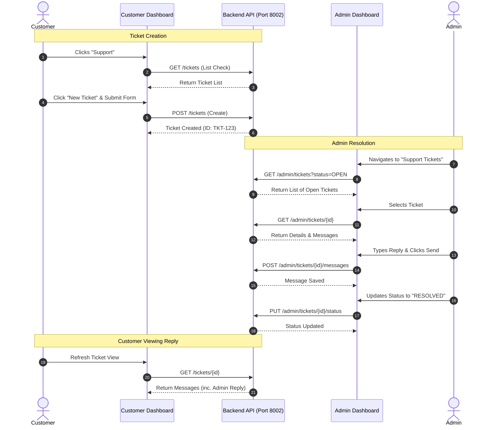
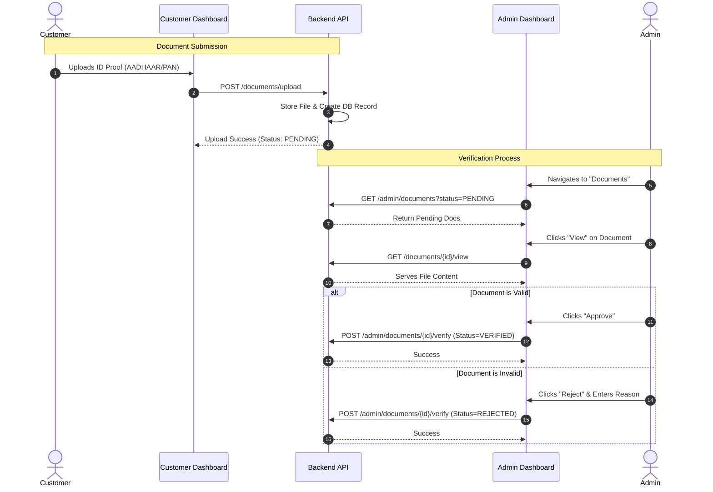
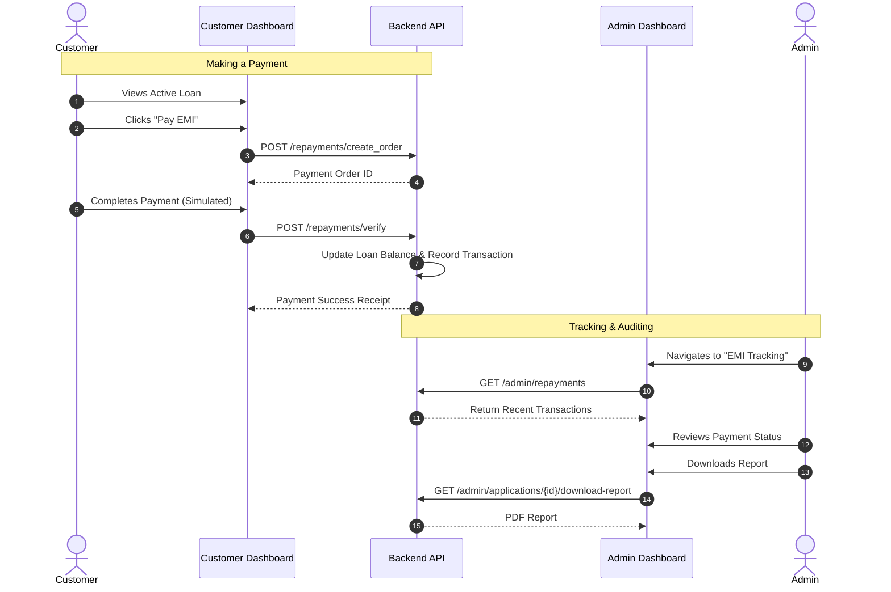
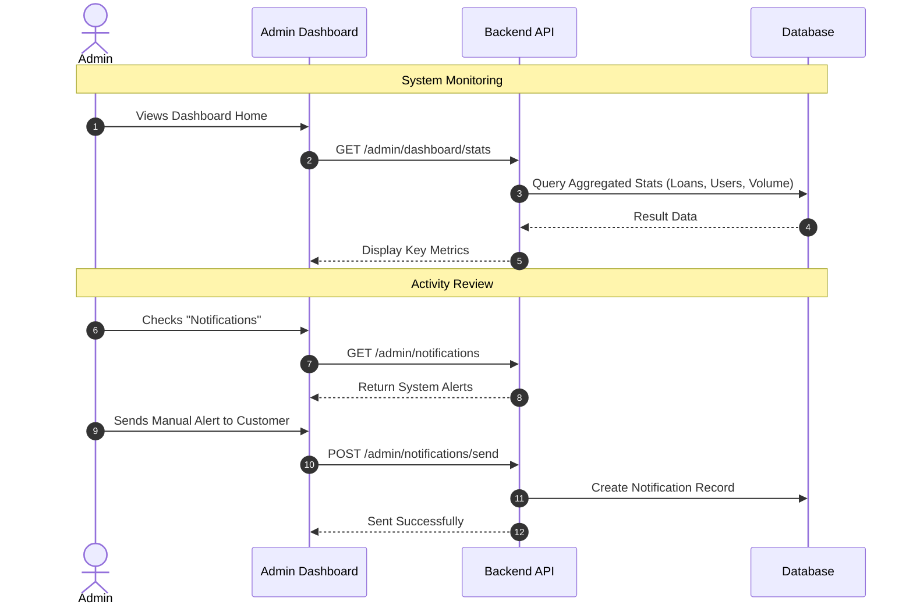

# System Workflows

The following sequence diagrams illustrate the key workflows within the Loan Management System.

## 1. Support Ticket System Workflow
This flow demonstrates how a customer raises a support request and how an admin resolves it.

View Source (Mermaid)

## 2. KYC Document Verification Workflow
This flow shows the process of a customer uploading documents and an admin verifying them.

View Source (Mermaid)

## 3. Loan Repayment Tracking Workflow
This flow illustrates a customer making an EMI payment and the admin tracking it.

View Source (Mermaid)

## 4. Admin Audit & Monitoring Workflow (Proposed)
This represents the flow for monitoring system activities and alerts.

View Source (Mermaid)

